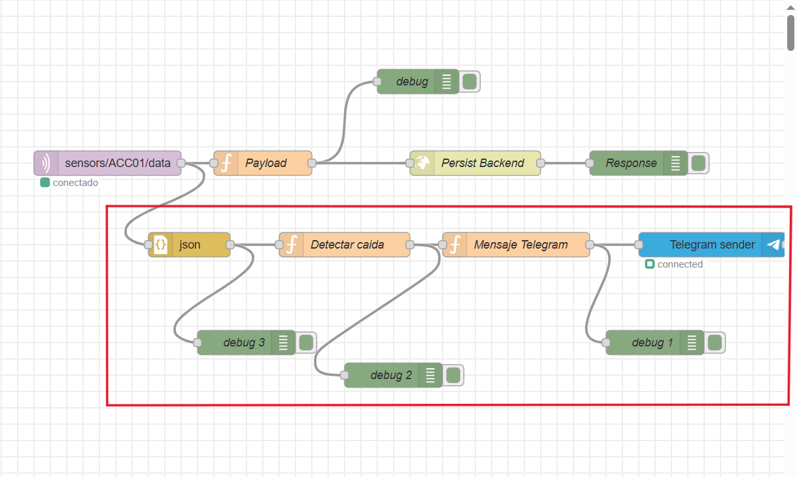
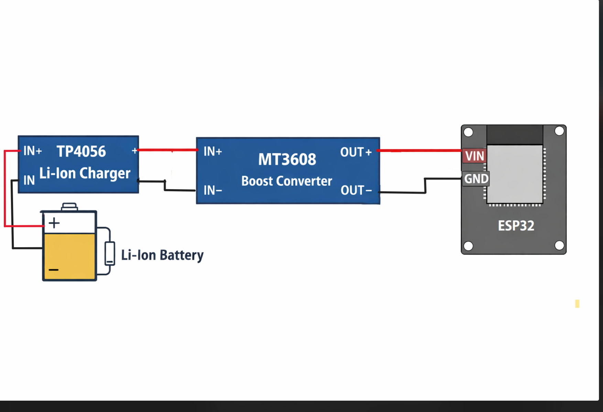
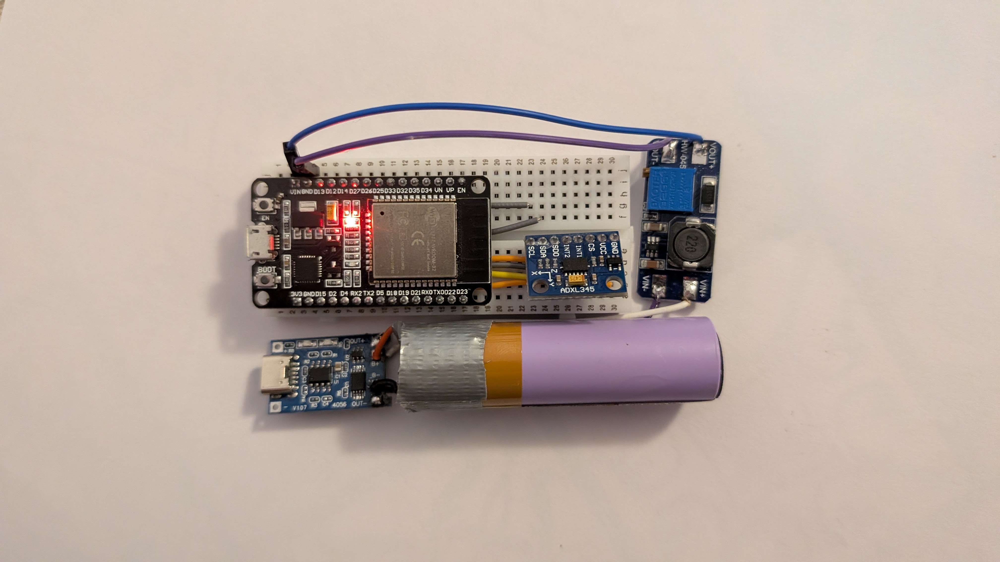
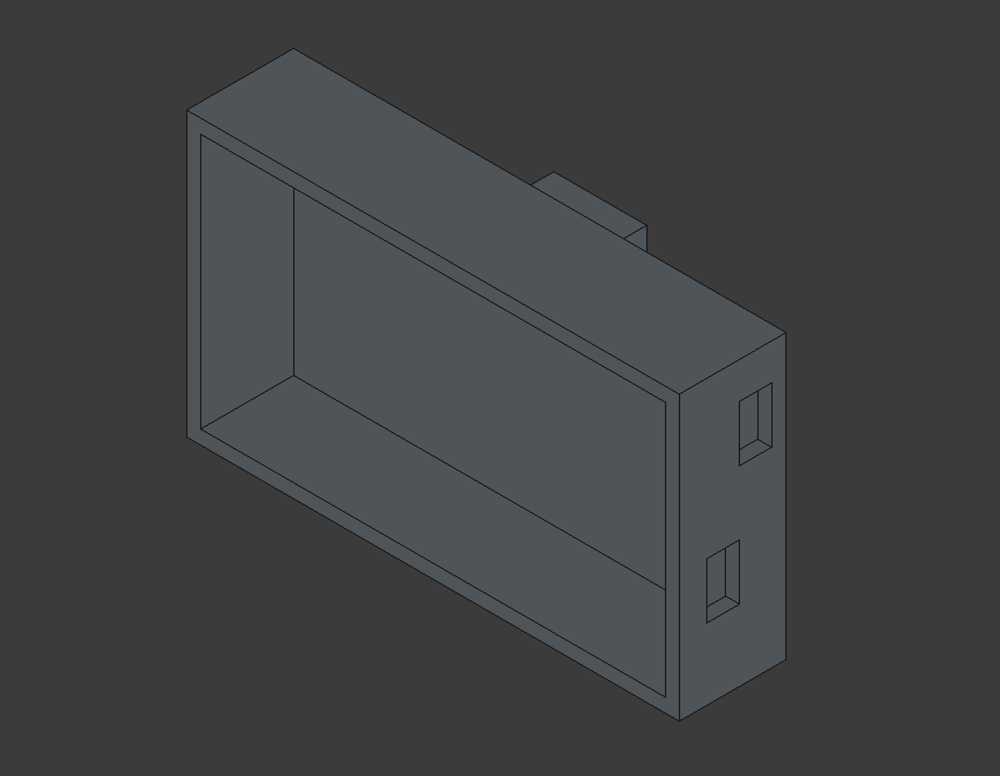
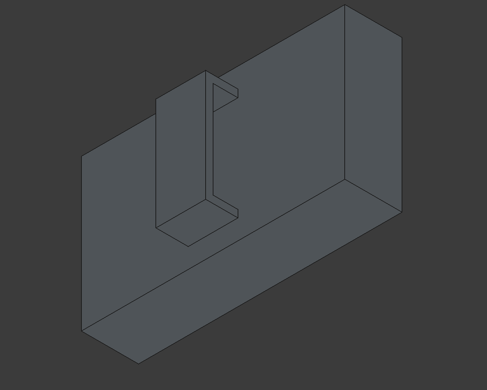
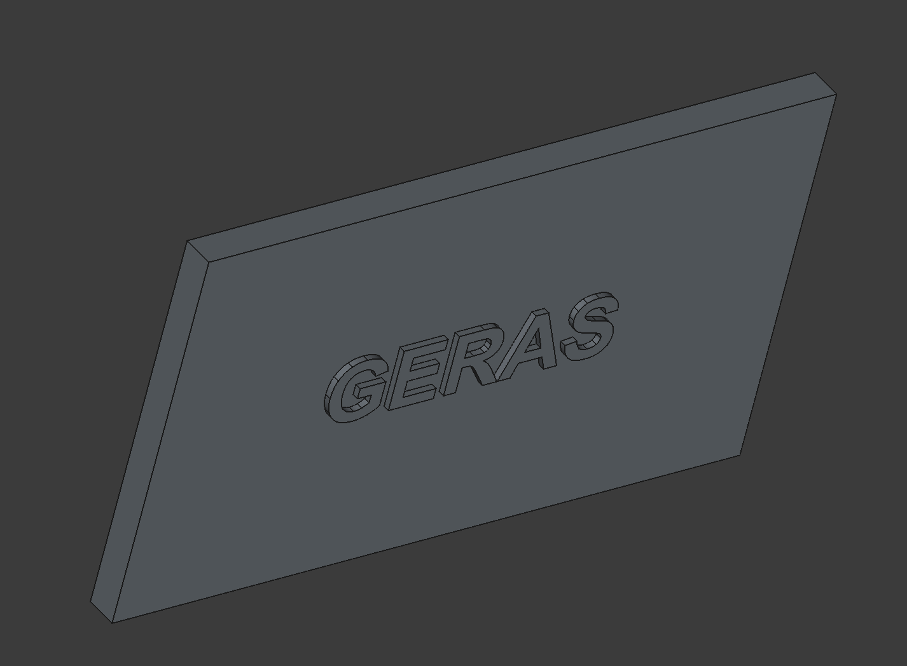
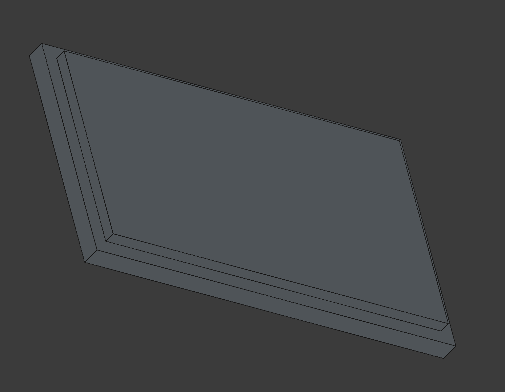

# Trabajo Robotica
En este pratica, partiendo del trabajo de Miguel, intente diseñar un prototipo de alarma para la tercera edad, para que en el momento de una caida
se detecte un pico de aceleracion y mande un aviso a un familiar cercano. Voy a ir mostrando lo que implemente por partes

## INICIALIZAR
Antes de empezar **RECORDAR** meter las credenciales "admin" y "password" en la primera funcion en la pestaña de seguridad

## 1º Parte: SOFTWARE
Este seria mi workflow de NODE-RED:

La parte recuadrada en rojo seria el flow que agrege para la alarma. Consta de un :

-> Un json, para transformar los datos que me dan de texto (string) a objeto, y asi pueda las demas funciones leerlo e interactuar con él

-> Un funcion, "detectar caida" que hace el modulo de las 3 aceleraciones y pone un **Triger** de alarma, el cual podemos variar por sensibilidad (Demasiado alto nunca salta/bajo salta siempre) , con lo cual si el valor del modulo es superior a el manda un aviso a la sieguiente funcion. También tiene un cooldown, ya que si no mandaria un mensaje cada valor por encima del trigger y no solo
una vez por haberlo superado

-> Otra funcion, "mensaje telegram", esta coge el aviso y los datos dados por la funcion anterior y los transforma a algo entendible para telegram. Es aqui donde, si quieres cambiar la persona de confianza a la que avisaras, deberás cambiar el CHAT_ID al de la persona que quieras, mas abajo te explico como se hace

-> Un telegram sender, que simplente coge el mensaje y lo manda, a traves de un bot, la persona de confianza. Este flow no viene default con node-red,
asi que tuve que añadir esto en el dockerfile para instalarlo de primeras:
```shell
$ RUN npm install --unsafe-perm node-red-contrib-telegrambot
```
### Telegram
Dentro del Telegram tuve que crear el bot, para ello tuve que buscar el bot @BotFather y usar el comando:
```shell
$ /newbot
```
y seguir los pasos que me dicen, que es basicamente darle un nombre (en mi caso geras) y un nick,@xxxxx_bot (@ggeras_bot) para buscarlo, y despues ya estara hecho y te ortogara un token
**IMPORTANTE** El node red no guarda el token, asi que tendras que meterlo a mano en el menu de edicion del bot, en este caso:

TOKEN:
```shell
$ 7978614518:AAHV4bIed1x762dUeuG0R8OQxCsOzs2gHhk
```
Para sacar tu **CHAT_ID** buscarás el bot @userinfobot y mandarle el comando:
```shell
$ /start
```
**NOTA** Si creas un bot nuevo, recuerda inicializarlo mandanole un mensaje

## 2º parte: HARDWARE
Como el proposito era que un seño lo llevara encima, decidi hcaerlo portatil, para ello adquiri 3 cosas:

-> Una bateria de litio: la cual me daba entre 3,6V-4V

-> Un TP4056, que es un cargador de baterias con proteccion, por si hay algun pico de la red o la tension esta demasiado baja corta alimentacion (por cierto tiene puerto USb Type C)

-> Un MT3608, que es un boost, para elevar la tension de 3,6-4 de la pila hasta los 5V que requiere el ESP32

Una vez todo conectado nos quedaria un esquema tal que asi:


Quedando en la vida real asi


Ademas de esto, como la idea era que fuera portatil, tambien hice una caja, para poder llevarlo en el cinturon o en su caso colago del cuello





Y con esto doy por concluido mi trabajao/prototipo, al que llame GERAS, en la mitologia griega el dios protector de los ancianos
